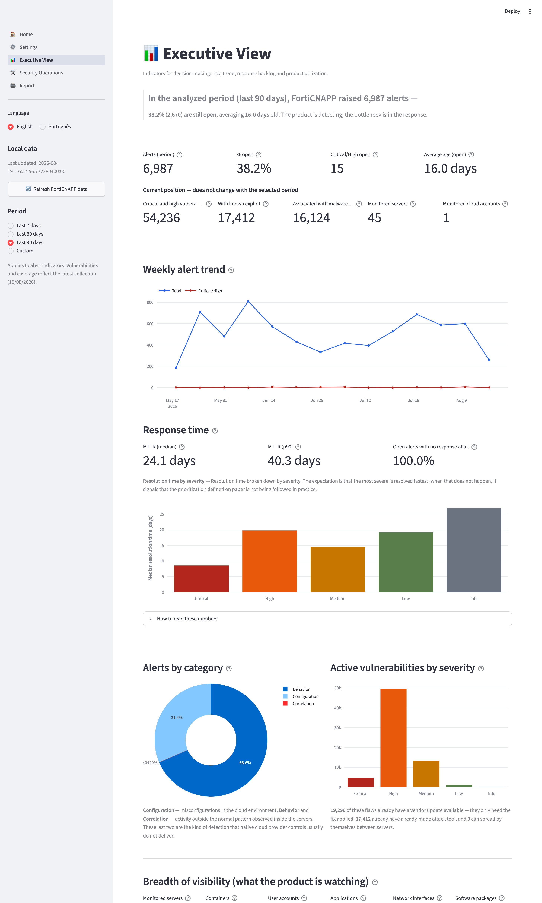
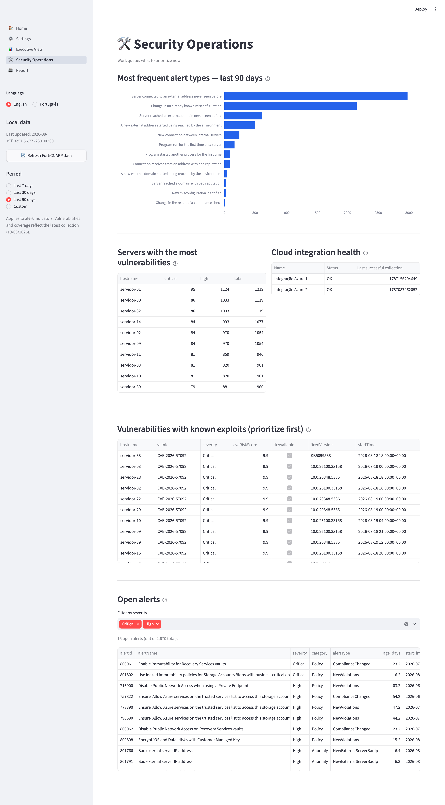
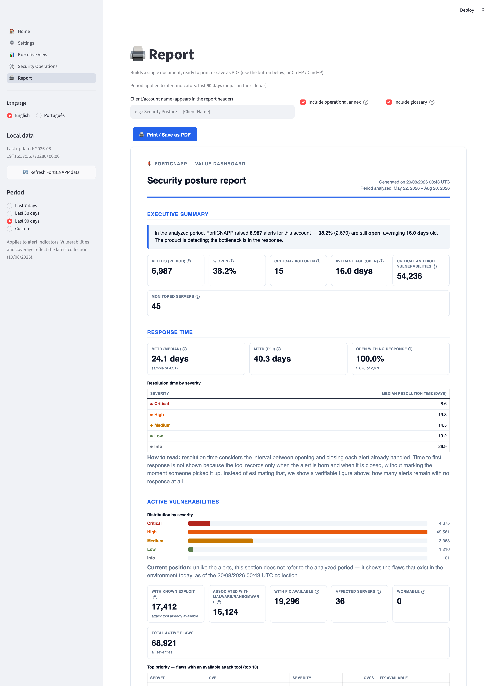

# FortiCNAPP — Painel de Valor

*[English version](README.md)*

Conecta na API do FortiCNAPP (Lacework v2) da sua própria conta, cacheia os dados **localmente**
(pasta `data/`, nunca sai da sua máquina) e os traduz em indicadores para dois públicos:

- **Visão Gerencial** — para quem decide: tendência de risco, tempo de resposta (MTTR), utilização
  do produto.
- **Operações de Segurança** — fila de trabalho do time técnico: alertas em aberto,
  vulnerabilidades com exploit conhecido, saúde das integrações.
- **Relatório** — consolida os indicadores num layout profissional, pronto para impressão ou para
  salvar como PDF (impressão nativa do navegador), com nome do cliente personalizável.

Disponível em **inglês e português** — troque pela barra lateral a qualquer momento.

As credenciais da API também ficam só na sua máquina (pasta `config/`, nunca é commitada nem
enviada a lugar nenhum além da própria API do FortiCNAPP).

## Exemplos

> As imagens abaixo foram geradas com o **modo demonstração** ligado: nomes de servidores,
> usuários, domínio e integrações aparecem pseudonimizados. Os números, severidades e CVEs são
> reais — o que se vê é exatamente o que o painel produz.

### Visão Gerencial



### Operações de Segurança



### Relatório para impressão



## Como rodar

Primeiro, clone o repositório:

```bash
git clone https://github.com/Jamsux/forticnapp-painel-de-valor.git
cd forticnapp-painel-de-valor
```

### Opção 1 — Docker (recomendado, funciona igual em Windows, macOS e Linux)

```bash
docker compose up --build
```

Acesse [http://localhost:8501](http://localhost:8501), vá em **⚙️ Configuração** e cole sua API
Key do FortiCNAPP. Os dados e a configuração ficam persistidos nas pastas `data/` e `config/` do
host (montadas como volume), então sobrevivem a reinícios do container.

No Windows, basta ter o [Docker Desktop](https://www.docker.com/products/docker-desktop/)
instalado e rodar o comando acima no PowerShell.

### Opção 2 — Python local (macOS / Linux)

```bash
python3 -m venv .venv
source .venv/bin/activate
pip install -r requirements.txt

streamlit run dashboard/Home.py
```

### Opção 3 — Python local (Windows / PowerShell)

Requer [Python 3.10+](https://www.python.org/downloads/) — na instalação, marque
**"Add Python to PATH"**.

```powershell
python -m venv .venv
.venv\Scripts\Activate.ps1
pip install -r requirements.txt

streamlit run dashboard/Home.py
```

> Se o PowerShell bloquear a ativação do ambiente virtual, libere os scripts para o seu usuário:
> `Set-ExecutionPolicy -ExecutionPolicy RemoteSigned -Scope CurrentUser`

No Windows, use `python` no lugar de `python3` nos demais comandos deste README
(ex.: `python scripts\refresh_data.py`).

Em qualquer uma das opções, acesse [http://localhost:8501](http://localhost:8501) e cadastre sua
API Key em **⚙️ Configuração**.

## Idioma

A barra lateral tem um seletor de idioma (**English / Português**) que vale para toda a aplicação,
inclusive para o relatório impresso. O padrão é inglês.

Para mudar o padrão, defina a variável de ambiente `APP_LANG` (`en` ou `pt`), ou passe `--lang`
para o script de exportação.

## Como obter a API Key do FortiCNAPP

1. No console do FortiCNAPP (`https://SUACONTA.lacework.net`), vá em **Settings → API Keys**.
2. Crie uma chave com permissão de leitura.
3. Baixe o `.json` gerado (contém `keyId`, `secret`, `account`) e cole na tela de Configuração do
   dashboard — ou preencha os três campos manualmente.

Para ambientes automatizados, defina as variáveis de ambiente `FORTICNAPP_KEY_ID`,
`FORTICNAPP_SECRET` e `FORTICNAPP_ACCOUNT` (veja `.env.example`). Elas têm prioridade sobre o que
for salvo pela tela de Configuração.

## Período de análise

A barra lateral tem um seletor de período: **7 / 30 / 90 dias** ou um **intervalo personalizado**.
A escolha vale para todas as páginas e para o relatório impresso.

Duas coisas importantes:

- **O período recorta os indicadores de alertas** (volume, tendência, MTTR, tipos de alerta, fila
  em aberto). **Vulnerabilidades e cobertura são a fotografia atual** do ambiente — o produto não
  guarda "as vulnerabilidades de junho", guarda o estado de hoje. Isso fica sinalizado na tela e no
  relatório.
- **O limite é 90 dias**, imposto pela própria API (`startTime has to be within the past 90 Days`).
  Como a coleta já traz a janela inteira, trocar de período é instantâneo — não refaz consultas.

**Cuidado com períodos curtos:** o recorte é pela data de criação do alerta, então numa janela
curta só entram como "resolvidos" os alertas que nasceram e foram fechados dentro dela. Isso infla
o "% em aberto" e derruba artificialmente o tempo de resolução (nos últimos 7 dias da conta de
exemplo há *zero* alertas fechados, e o MTTR apareceria como "0 dias"). O painel detecta esse caso,
exibe "—" em vez de um número enganoso e mostra um aviso explicando. Para avaliar capacidade de
resposta, use 90 dias.

Pela linha de comando:

```bash
python3 scripts/export_report.py --out relatorio.pdf --pdf --days 30
python3 scripts/export_report.py --out relatorio.pdf --pdf --from 2026-06-01 --to 2026-06-30
```

## Atualizando os dados

- Pelo dashboard: botão **"🔄 Atualizar dados do FortiCNAPP"** na barra lateral.
- Pelo terminal: `python3 scripts/refresh_data.py` (dentro do venv) — útil para agendar via cron.

## Explicação dos indicadores

Todo indicador exibido tem um tooltip (ícone **?**) explicando o que ele significa e como é
calculado. As definições ficam centralizadas em [`src/glossary.py`](src/glossary.py) — fonte única
de verdade compartilhada pelos dashboards e pelo relatório, para que o mesmo número nunca seja
explicado de duas formas diferentes. Como tooltips não existem no papel, o relatório impresso
inclui as mesmas definições numa seção **Glossário dos indicadores** ao final (pode ser desligada).

## Relatório para impressão

A página **🖨️ Relatório** monta um documento único (cabeçalho com nome do cliente, resumo
executivo, tempo de resposta, vulnerabilidades, cobertura e um anexo operacional opcional) com um
layout de relatório — não uma captura do dashboard. Clique em **"Imprimir / Salvar como PDF"** (ou
use Ctrl+P / Cmd+P): a barra lateral e os controles da própria página somem automaticamente da
versão impressa/PDF, sobrando só o relatório.

O CSS de impressão cuida da paginação: quebras só entre blocos (nunca no meio de um card, linha de
tabela ou definição), cabeçalho de tabela repetido a cada página, cores preservadas no papel, e os
contêineres de rolagem do Streamlit convertidos em fluxo normal — sem isso o navegador recorta tudo
que passa da primeira página.

### Gerar o relatório sem abrir o dashboard

```bash
python3 scripts/export_report.py --out relatorio.pdf --pdf --client-name "Nome do Cliente" --lang pt
```

Gera HTML autocontido (padrão) ou PDF (`--pdf`, via Chrome/Chromium headless). Usa exatamente a
mesma função de montagem da página do dashboard (`src/report.build_report_html`), então o resultado
é idêntico — útil para agendar o envio periódico de um PDF.

## O que é coletado

- **Alertas** (últimos 90 dias, todas as páginas) — cobre CSPM (categoria `Policy`), comportamento
  anômalo (`Anomaly`) e detecções compostas (`Composite`).
- **Vulnerabilidades ativas em hosts** — contagem por severidade + detalhe de Critical/High
  (deduplicado por host+CVE), incluindo flags de exploit público/conhecido.
- **Inventário** — servidores monitorados, contas cloud conectadas e sua saúde, contagens de
  visibilidade (usuários, aplicações, pacotes, interfaces de rede).
- **Regras/contrato** — `AlertRules`, `ReportRules`, `ResourceGroups`.

## Indicadores de tempo de resposta (MTTR / MTTA / MTTD)

A Visão Gerencial traz **MTTR** (Mean Time to Resolve) real, calculado a partir de
`lastUserUpdatedTime − startTime` dos alertas com `status = Closed` — mediana e p90, geral e por
severidade, com a fórmula explicada num expander na própria página.

**MTTA e MTTD não são reportados** porque a API não sustenta esse cálculo: não existe um evento de
"reconhecido" distinto de "fechado" nos dados de `Alerts/search`, e os endpoints de
detalhe/histórico por alerta (`/Alerts/{id}`, `/Alerts/{id}/Timeline`) retornaram erro 400/500 nos
testes. No lugar de estimar esses números, o dashboard mostra um dado real equivalente: a fração de
alertas atualmente abertos sem nenhuma interação registrada desde a criação — sinal mais honesto do
gap de resposta do que um MTTA aproximado.

## Limitações conhecidas da API

- O endpoint `Configs/ComplianceEvaluations/search` não respondeu com nenhum corpo de requisição
  testado (erro genérico "Invalid request", mesmo com `timeFilter`/`filters` válidos) — a
  documentação completa está atrás de login em fndn.fortinet.net. Como contorno, o indicador de
  CSPM/compliance vem da categoria `Policy` dentro de `Alerts`, que já reflete achados reais de
  configuração incorreta.
- Não foi encontrado endpoint v2 dedicado a **CIEM** (entitlements de identidade) — pode ser que o
  módulo não esteja habilitado na conta testada, ou que use outro caminho de API.
- `GET /api/v2/ContractInfo` apresentou instabilidade (erro 500 intermitente) durante os testes —
  o script de coleta não trava nesse caso, apenas pula esse dado.

## Modo demonstração (para prints e apresentações)

Para mostrar o painel sem expor identificadores do ambiente, rode com a variável
`FORTICNAPP_DEMO=1`:

```bash
FORTICNAPP_DEMO=1 streamlit run dashboard/Home.py
```

Nesse modo, ao carregar os dados são pseudonimizados: nomes de servidores (inclusive quando citados
dentro das descrições dos alertas), contas de usuário e domínio, nomes das integrações cloud e
e-mails. **Contagens, severidades, CVEs e datas permanecem intactos** — e os identificadores de
conta cloud recebem pseudônimos estáveis, para que "uma conta com duas integrações" continue sendo
contada como uma conta.

As imagens deste README foram geradas assim:

```bash
python3 scripts/capture_screenshots.py
```

## Estrutura do projeto

```
dashboard/           # app Streamlit (ponto de entrada + páginas)
src/                 # cliente de API, coletores, agregação, i18n, relatório
scripts/             # coleta de dados, exportação do relatório, capturas de tela
config/              # credenciais (gitignored, criado em runtime)
data/                # cache local dos dados coletados (gitignored, criado em runtime)
```

## Segurança

- Nenhuma credencial é commitada: `config/` e qualquer `*.json` estão no `.gitignore` e no
  `.dockerignore`.
- Os dados coletados (`data/`) também não saem da máquina onde o dashboard roda.
- A API Key só precisa de permissão de **leitura**.

## Licença

Apache 2.0 — veja [LICENSE](LICENSE).
